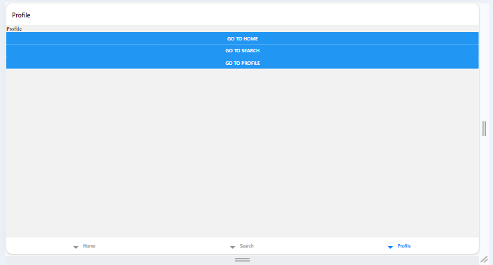

# React Native with Expo - 02-03-26

A React Native mobile application built with Expo featuring bottom tab navigation between Home, Search, and Profile screens.

## Output



## Installation

### Clone the Repository
```powershell
git clone --depth 1 --filter=blob:none --sparse https://github.com/D3V-S4NJ4Y/TT-Classes.git; cd TT-Classes; git sparse-checkout set 02-03-26
```

### Navigate to Project Directory

```powershell
cd 02-03-26/my-app
```

### Install Dependencies

```powershell
npm install
```

## Running the Project

### Start Development Server

```powershell
npm start
```

### Run on Specific Platform

```powershell
# Web
npm run web
# or press 'w' in terminal

# Android
npm run android
# or press 'a' in terminal

# iOS
npm run ios
# or press 'i' in terminal (macOS only)
```

## Creating a New Expo Project (Reference)

If you need to recreate this project from scratch:

1. **Create New Expo Project**
   ```powershell
   npx create-expo-app@latest my-app
   cd my-app
   ```

2. **Delete App Folder**
   ```powershell
   rm -rf app
   ```

3. **Update package.json**
   Change `"main": "expo-router/entry"` to `"main": "node_modules/expo/AppEntry.js"`

4. **Install Navigation Dependencies**

```powershell
npm install @react-navigation/stack
```

```powershell
npx expo install react-native-gesture-handler @react-native-masked-view/masked-view
```

   ```powershell
   npm install @react-navigation/native @react-navigation/bottom-tabs
   npx expo install react-native-gesture-handler @react-native-masked-view/masked-view react-native-screens react-native-safe-area-context
   ```

## Project Structure

```
02-03-26/
├── README.md                    # Project documentation
└── my-app/
    ├── App.js                  # Main application entry point
    ├── package.json            # Dependencies and scripts
    ├── app.json                # Expo configuration
    ├── tsconfig.json           # TypeScript configuration
    ├── assets/                 # Images and static assets
    │   └── images/
    │       ├── icon.png
    │       ├── favicon.png
    │       └── output.png
    └── src/
        └── screens/
            ├── Home.jsx       # Home screen component
            ├── Search.jsx     # Search screen component
            └── Profile.jsx    # Profile screen component
```

## Key Components

### App.js
Main application file that sets up bottom tab navigation using `@react-navigation/bottom-tabs` and `@react-navigation/native`.

### Screens

| File | Description |
|------|-------------|
| `Home.jsx` | Home screen with welcome message |
| `Search.jsx` | Search screen for searching content |
| `Profile.jsx` | User profile screen with navigation to Home |