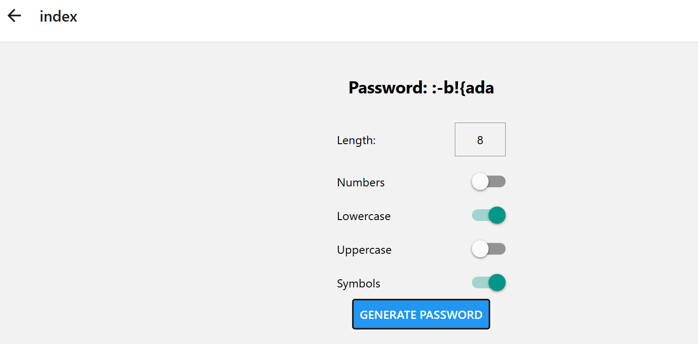

# React Native with Expo - 24-02-26

Create a minor "Password Generator" project using useEffect and useState.

## Output



## Installation

### Clone the Repository
```powershell
git clone --depth 1 --filter=blob:none --sparse https://github.com/D3V-S4NJ4Y/TT-Classes.git; cd TT-Classes; git sparse-checkout set 24-02-26
```

### Install Dependencies
```powershell
cd 24-02-26/my-app
npm install
```

## Running the Project

```powershell
npm start
```

This will start the Expo server. You can run on:
- **Web**: Press `w` in the terminal or visit http://localhost:8081
- **Android**: Press `a` (requires Android setup)
- **iOS**: Press `i` (requires Xcode on macOS)

## Key Components
**index.tsx** A main application of Password Generator